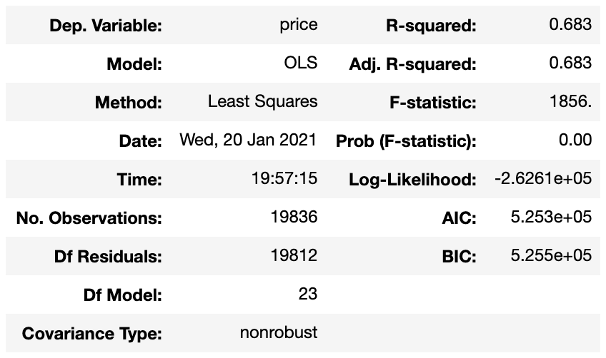
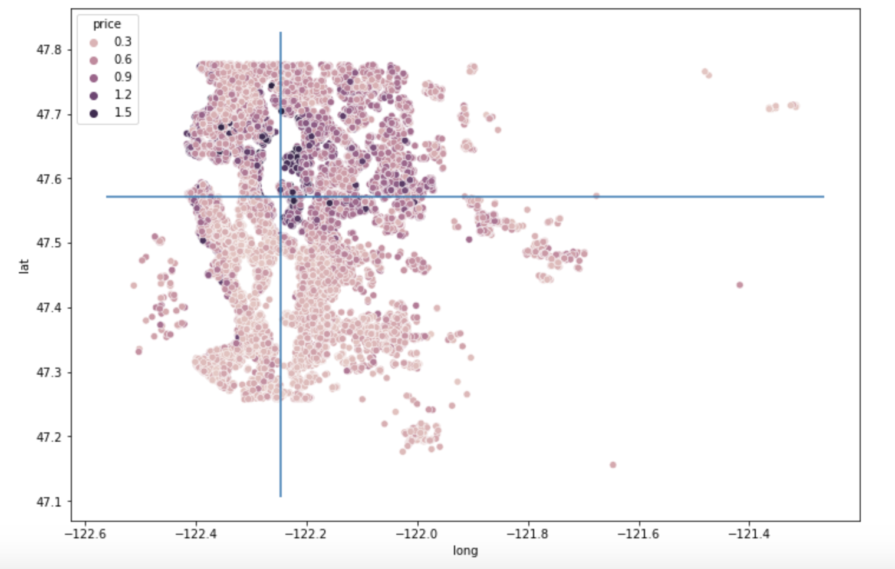
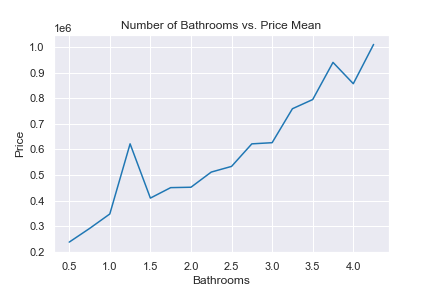
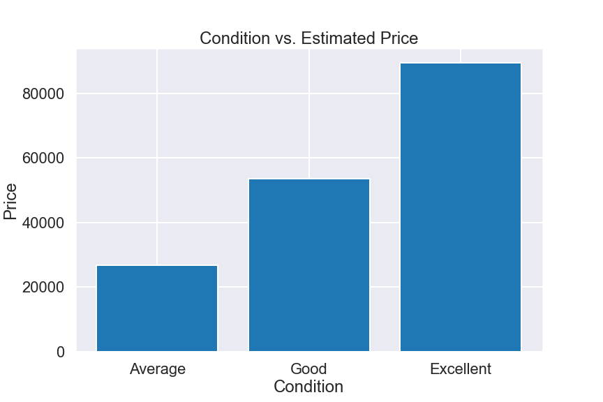
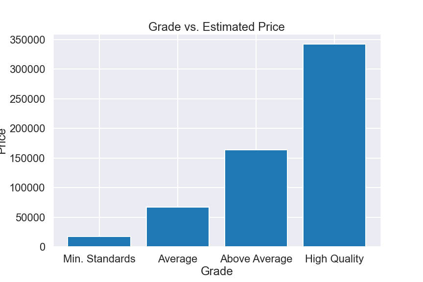

# Understanding the Housing Market

Author: Hogan Byun

## Project Overview

This project analyzes house sales data in to provide data-driven recommendations for house flippers. Data analysis results shows that recommended areas of improveement before selling a house are the number of bathrooms, the grade/condition of the home, and the number of house views. Focusing on increasing these metrics will correlate to higher sale prices.

## The Data

This project uses the King County House Sales dataset, which can be found in  `kc_house_data.csv` in the data folder in this repo. The description of the column names can be found in `column_names.md` in the same folder. A list of zipcodes and their corresponding city is located in 'zipcode_city.csv', which was taken from https://www.zip-codes.com/county/wa-king.asp. A list of cities and their respective quadrant is located in 'data/quadrant.csv'.


## Business Problem

HB Consulting, a consulting company based in King County, WA, has decided expand into the housing market and is looking for data-backed recommendations for the average house-flipper. Among these recommendations, they are looking for what houses to buy and what changes should be made in order to increase the values of the respective homes.

## Methods

This project uses descriptive analysis and visualization through Python, along with associated libraries, such as scipy.stats. Multiiple linear regression is the main methodology to provide a good prediction of how certain variables may affect a house's price.

## Results

### Model Used
The first thing to do, before making predictions, is to choose a final model to base those predictions from. Picture below is the summary for the final model. 



Here, we see that the R-squared value is 0.683. This tells us that 68.3% of the variation in price is explained by our model. Even though there were better fitting models to choose from, the key reason that this one was chosen was that it kept the number of categorical variables dummies low while not sacrificing too much data fit. The following binnings were made to categorical variables:

**Condition** was changed from a 1-5 scale to the following:
- 1-2 Bad
- 3 Average
- 4 Good
- 5 Excellent

**Grade** was converted from a 1-13 scale to the following:
- 1-5 Failure to meet building codes
- 6 Minimum standards
- 7 Average
- 8-9 Above Average
- 10-13 High Quality

**Zipcode** needed two binnings to size down the number of variables:
The first binning organized each zip code into its corresponding city. While this did lower the number of categorical variables considerably, there were still 23 remaining, which was a bit too high. 

The next binning took these 23 cities and separated them into a quadrant depending on its location. Because some cities would cross through or overlap a quadrant boundary, in order to be consistent, I considered a city's "location" to be where Google Maps places the pin. The picture below shows the location of each city and the median latitude/longitude (red) among all the house locations.


The next photo will show the quadrants and all the zip code data points.



Here are the quadrants and corresponding cities:
- Quadrant 1 (Top-left): Seattle, Kenmore

- Quadrant 2 (Top-right): Medina, Bellevue, Kirkland, Redmond, Duvall, Carnation, Fall City, Sammamish, Bothel, Woodinville, Mercer Island

- Quadrant 3 (Bottom-left): Federal Way, Vashon, Kent

- Quadrant 4 (Bottom-right): Snoqualmie, Issaquah, Renton, North Bend, Black Diamond, Auburn, Maple Valley, Enumclaw

**Month** was simply binned into seasons (eg. Winter is Dec, Jan, Feb and so on)

### Recommendations
Now that the background on the final model is covered, here were the recommended house attributes to target: Bathrooms, Grade/Condition, and View. All of these were chosen for two reasons. One, they had high coefficients in the model, meaning that changes in these variables predicted higher changes in price. Two, they were improvable and scalable, that is, they are easily changed through renovations or other means and each change is measurable.  

**Bathrooms**
*Correlation Coefficient: 36,170*
One thing to note about bathrooms are that the number of bathrooms for a house increment by 0.25 and not by 1. This is because there a classifications for certain kinds of bathrooms. Those being:

- 1/4 bathroom: contains either a sink, shower, toilet, or bathtub
- 1/2 bathroom: contains only a toilet and sink (no shower or bath)
- 3/4 bathroom: contains one sink, one toilet, and either a shower or bath
- Full bathroom: contains one of each: sink, toilet, shower, and bath

The easy thing about adding bathrooms is that these changes can be implemented without the need to create a new room in the house. Instead, you could just add features to existing bathrooms to get the total up, which would be much more managable and cost-efficient. Below is a chart showing the house price for each 0.25 increment.



When flipping houses, ideally, you want to spend the least amount of money for the most amount of profit. Thus, when aiming to increase a house's bathroom count by 0.25, we can see some opportunities in the following:
- 1 to 1.25
- 3 to 3.25
- 3.5 to 3.75
- 4 to 4.25

Yet, in general, adding a bathroom will probably cost much less than $36,170, so aim to upgrade current bathrooms even if the house does not currently have the values above.

**Grade/Condition**
Though these two criteria follow a different scale, they both measure the quality of a home. Here are the results for condition and grade:





For the average house-flipper, their main goal is probably to buy houses, fix them up while spending less money, and selling quickly. In this case, I would recommend targeting the lower-tier homes and upgrading them just enough to the next threshold. For both grade and condition, these would simple fixes such as fresh pain jobs or cleaning. 

**View**
*Correlation Coefficient: 38,020*
The data given indicated a house's "view" from 0 to 4 while describing it as an indicator of whether a house had been viewed. From here, the assumption was made that the view category measured the number of times a home had been viewed. Below is the graph showing home prices for each view number:


The useful thing about choosing to improve views is that there will be no maintenance costs because no work is being done on the home. Hosting more open houses is an easy way to generate exposure to potential buyers and potentially increasing the future sale price.

### Final Recommendation

The final recommendations are... 
- Increase the number of bathrooms **without** clearing walls or creating a new physical bathroom. Instead, upgrade existing bathrooms by adding the respective features.
- Aim to buy houses that are lower-tier in grade or condition and fixing them up to the next possible tier. This will ensure cheaper and faster flips.
- Open as many open houses as you can to increase exposure and potential buyers. 

### Future Work

On top of the analysis done so far, there are a few areas that I would like to examine more to provide a clearer picture of how to approach this housing market:

- **Location-based analysis**: Since the data is there, finding some ways to predict price based on a certin zip-code or neighborhood would be useful.

- **Purchase date and effect on price**: Further examination of purchase date data could reveal potential times to buy low and sell high.

-**Further optimizing model**: While the model fit was good enough for how many variables it sacrificed, it was not perfect as around 31% of price variation was not explained by the model. Finding a better-fitting way to group variables might be key in creating a better model.

## For More Information

See the full analysis in the [Jupyter Notebook](./house_code.ipynb) or review this [presentation](./Understanding_The_Housing_Market.pdf).

For additional info, contact Hogan Byun at [hoganbyun@gmail.com](mailto:hoganbyun@gmail.com)

## Repository Structure

```
├── plots
├── data
├   ├── column_names.md
├   ├── kc_house_data.csv
├   ├── quadrant.csv
├   └── zipcode_city.csv
├── README.md
├── Understanding_The_Housing_Market.pdf
└── house_code.ipynb
```
